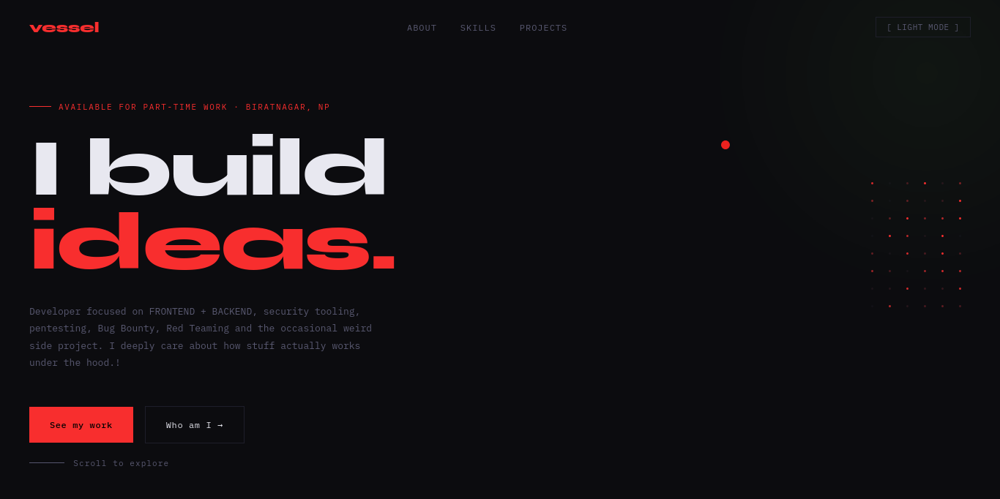

# 🧇 Waffles Demo

A dark, minimal portfolio website built with pure **HTML**, **CSS**, and **vanilla JavaScript**.

This site is my `DEMO` personal developer portfolio, built to showcase what I’m learning and building across frontend/backend development, security tooling, pentesting, red teaming, Linux, and weird experimental side projects.

No frameworks. No build system. No dependency drama.



---

## ✨ Features

- Clean dark portfolio UI
- Homepage with intro, about, skills, and contact sections
- Dedicated projects page
- Project filtering by category
- Theme toggle
- Scroll-based animations
- Custom cursor interaction
- Text scramble effect
- Static deployment ready
- Zero dependencies

---

## 🧠 Tech Stack

| Area | Tech |
| --- | --- |
| Structure | HTML5 |
| Styling | CSS3 |
| Interactions | Vanilla JavaScript |
| Hosting | Vercel |
| Version Control | Git + GitHub |

---

## 📁 Project Structure

```txt
waffles-demo/
├── design/
│   ├── index.css
│   └── projects.css
├── page/
│   └── projects.html
├── public/
│   ├── brainrot-museum.png
│   ├── chess-engine.jpeg
│   ├── cyber-tools.png
│   ├── dns.jpeg
│   ├── icarus.jpeg
│   ├── slushie-lab.png
│   └── waffle-demo.png
├── index.html
├── vercel.json
├── LICENSE
└── README.md
````

---

## 🚀 Live Demo

```txt
https://waffles-demo-rosy.vercel.app/
```

Projects page:

```txt
https://waffles-demo-rosy.vercel.app/projects
```

---

## 🛠️ Run Locally

Clone the repo:

```bash
git clone https://github.com/vessel-69/waffles-demo.git
cd waffles-demo
```

Because this is a static HTML/CSS/JS site, you do not need `npm install`.

Start a local server:

```bash
python3 -m http.server 3000
```

Then open:

```bash
http://localhost:3000
```

For the projects page:

```bash
http://localhost:3000/page/projects.html
```

---


### Vercel settings

Use these settings:

```txt
Framework Preset: Other
Build Command: empty
Output Directory: .
Root Directory: .
```

Then redeploy.

---

## 🧩 Pages

### Home

The homepage introduces Vessel, skills, background, and contact links.

```txt
/
```

### Projects

The projects page contains a filterable project showcase.

```txt
/projects
```

Current projects include:

* CyberTools API
* Slushie Lab
* Brainrot Museum
* Waffle Demo
* Chess Engine
* DNS & Networking Lab

---

## 🎨 Customization

To change the main content, edit:

```txt
index.html
page/projects.html
```

To change styling, edit:

```txt
design/index.css
design/projects.css
```

To change images, replace files inside:

```txt
public/
```

---


## 📜 License

This project is licensed under the MIT License.

See the [LICENSE](./LICENSE) file for details.

---

## 👤 Author

Built by **Vessel**.

```txt
GitHub: https://github.com/vessel-69
```

---

## ⚡ Note

This project intentionally keeps things simple.

No React.
No Next.js.
No Tailwind.
No build step.

Just HTML, CSS, JavaScript, and a clean static deploy.

````

